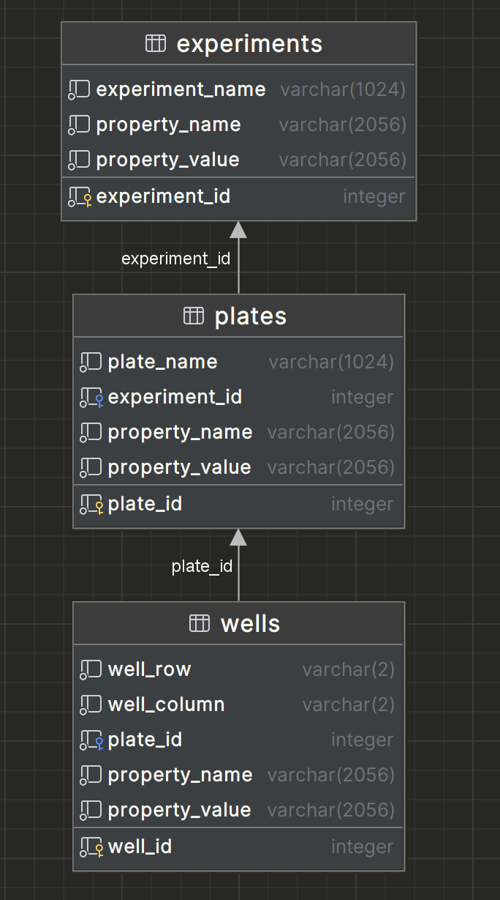

# Pandas homework 

You entered a life-science project, which helps teh scientists to handle the results of their experiments. The data
about experiments is stored in a databases, which has the following structure:

Each experiment has a set of plates, belonging to it. 
Each plate is a special device like this, containing wells inside them. 

Each well has a set of properties, which might vary according to experiments. 
It might be concentration, concentration_unit, type, channel, channel_order and any other properties (it's impossible to create 
a full list of them, because new ones could be easily added). 1 property - 1 record in a wells table.

In order to save some space, if all wells inside a plate have the same values, they are moved to plate level. 
The same happens to plates - if all plates inside experiment have the same value, those properties moved from 
plate level to experiment level. 

For one of our pipelines we need to get all properties for wells, including ones stored inside plates and experiments tables. 
You should use pandas to read the content of tables and combine them in a result table, which would contain columns 
well_id, well_row, well_column and properties for columns, specified in a property_name in wells, plates and experiments tables. 
If some value is not defined for some well, you should place here a None value. Save results to .xlsx file.
So, it should look like this:

**Extra task:** consider cases, then 2 properties are defined on 2 levels (for example, in well and plate tables), This way 
you should place the value from the lower level in a resulting table. 

**Extra task:** write the SQL script, which would do the same thing

### Evaluation criteria:
- Marks will be divided into either "passed" or "not passed". "Passed" stands for a working code that makes the job done.
- You could earn extra points if you:
    - wrote clean and easy to read code;
    - handled possible corner cases
    - showed a good Pandas usage 
    - wrote tests to cover the functionality 
    - provided a clean git history of features development 